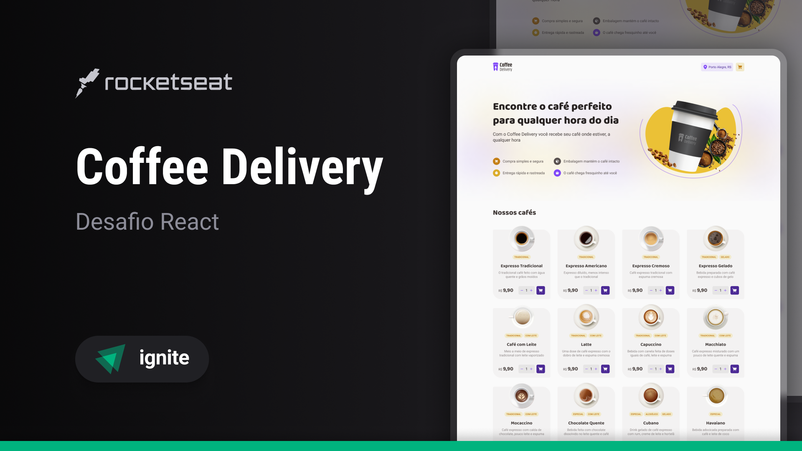

# Coffee Delivery
Minha resolução ao segundo desafio da trilha ReactJS do Ignite da empresa @Rocketseat. O projeto tem como objetivo avançar mais sobre o React com um projeto de delivery. 🚀 <br><br>



## 🚀 Tecnologias
- ✔️ ReactJS - Biblioteca Javascript
- ✔️ React Router DOM - Biblioteca para gerenciamento de Rotas
- ✔️ React Hook Form - Lib para controle de formulários
- ✔️ Immer - Lib para manipulação de dados imutáveis
- ✔️ Typescript - Superset do Javascript
- ✔️ Zod - Criação e validação de schema Typescript
- ✔️ Vite - Bundler e dev-server
- ✔️ Phosphor Icons - Biblioteca de ícones
- ✔️ Styled Components - Biblioteca para CSS-in-JS
- ✔️ AOS - Lib para animações com Scroll

## 📦️ Pré-Requisitos
Antes de começar você vai precisar ter instalado na sua máquina as ferramentas [Git](https://git-scm.com/) e [Node](https://nodejs.org/en/download/).

## ⚡ Executando o projeto
1. Clone o repositório
```
    git clone https://github.com/DouglasLacerdaC/IgniteCoffeeDelivery.git
```
2. Acesse a pasta do projeto e instale as dependências
```
    npm install
```
3. Execute o projeto
```
    npm run dev
```
4. Acesse pelo navegador
```
    http://127.0.0.1:5173/
```

Desenvolvido por [Douglas Lacerda](https://www.linkedin.com/in/douglas-lacerda-da-conceicao/)